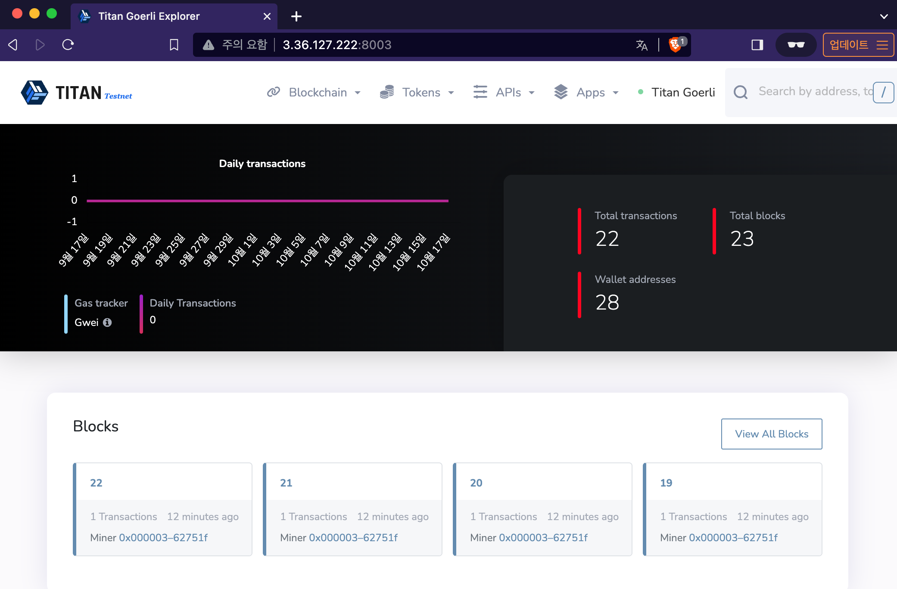
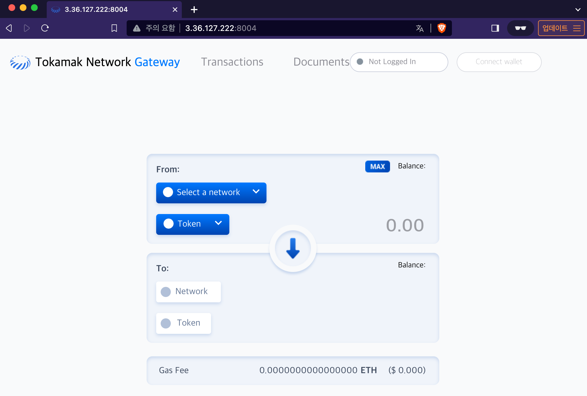

# tokamak-titan-simple-cluster

## Tokamak Titan k8s Resource Diagram


## Prerequisite

- [kubectl](https://kubernetes.io/docs/tasks/tools/#kubectl)
- [minikube](https://minikube.sigs.k8s.io/docs/start/)

If you own an AWS account and want to use EC2, go to [here](./terraform/README.md)

## Commands

```
run-simple-cluster.sh [TASK] [OPTION]

TASK:
  start         Start Titan Network or Apps
  delete        Delete Titan Network or Apps
  export        export server port

OPTION:
  -n, -namespace    Set namespace
  -s, -service      Set the service to run (titan, blockscout, gateway). default titan
```

## 1. Titan Network Node

### Start/Delete Node

#### Start Commands

The first run will take 3-5 minutes because it needs to download the image.

```bash
run-simple-cluster.sh start -s titan
```

#### Delete Commands

```bash
run-simple-cluster.sh delete -s titan
```

#### Server Domain

L1 Chain Domain address :`l1.local.tokamak.network`

L2 Geth Domain address : `l2geth.local.tokamak.network`

#### Check node is Running

Request:

```bash
# L1 chain
curl l1.local.tokamak.network -X POST --data '{"jsonrpc":"2.0","method":"net_listening","params":[],"id":67}'

# L2 Geth
curl l2geth.local.tokamak.network -X POST -H 'Content-type: application/json'  --data '{"jsonrpc":"2.0","method":"net_listening","params":[],"id":67}'
```

Response:

```bash
# L1 chain
{
  "id":67,
  "jsonrpc":"2.0",
  "result":true
}

# L2 Geth
{
  "jsonrpc":"2.0",
  "id":67,
  "result":true
}
```

### Connect account to Chain

#### Export server

If you are running nodes on AWS EC2 than you will need to export the server
**(If you are running locally, skip here and use [domain](#server-domain))**

Command:

```
run-simple-cluster.sh export
```

Result:

```bash
L1 Chian RPC address : http://{ec2-public-ip-address}:8001
L2 Geth RPC address : http://{ec2-public-ip-address}:8002
Press CTRL-C to stop server
```

#### Connet with Metamask

**Add Network**

| L1 Network      |                                          |
| --------------- | ---------------------------------------- |
| L1 RPC URL      | l1.local.tokamak.network or exported URL |
| ChainId         | 31337                                    |
| Currency symbol | ETH                                      |

| Titan Network   |                                              |
| --------------- | -------------------------------------------- |
| Titan RPC URL   | l2geth.local.tokamak.network or exported URL |
| ChainId         | 17                                           |
| Currency symbol | ETH                                          |

**Test Account**

We provide a Test account :

| Account | Private Key                                                        |
| :-----: | :----------------------------------------------------------------- |
| Test#1  | 0xa6aecc98b63bafb0de3b29ae9964b14acb4086057808be29f90150214ebd4a0f |

## 2. Titan Apps

Blockscout : block explorer for titan

Gateway : deposit/withdraw ETH between L1 and L2

### Start/Delete Apps

#### Start Commands

The first run will take 3-5 minutes because it needs to download the image.

```bash
# Blockscout
run-simple-cluster.sh start -s blockscout

# Gateway
run-simple-cluster.sh start -s gateway
```

#### Delete Commands

```bash
# Blockscout
run-simple-cluster.sh delete -s blockscout

# Gateway
run-simple-cluster.sh delete -s gateway
```

#### Apps Server Domain

Blockscout Domain address :`explorer.local.tokamak.network`

Gateway Domain address : `gateway.local.tokamak.network`

#### Check node is Running

Request:

```bash
# Blockscout
curl explorer.local.tokamak.network

# Gateway
curl gateway.local.tokamak.network
```

Response:

```bash
# Blockscout
...
...
<script defer data-cfasync="false" src="/js/app_extra-706de29ea178362d3534e02ac8ebe06c.js?vsn=d"></script>
  </body>
</html>


# Gateway
...
...
type="application/json">{"props":{"pageProps":{}},"page":"/","query":{},"buildId":"ntY29gUMhBO4humM4EDoG","nextExport":true,"autoExport":true,"isFallback":false,"scriptLoader":[]}</script></body></html>
```

#### Export server

If you are running nodes on AWS EC2 than you will need to export the server
**(If you are running locally, skip here and use [domain](#apps-server-domain))**

Command:

```
run-simple-cluster.sh export
```

Result:

```bash
L1 Chian RPC address : http://{ec2-public-ip-address}:8001
L2 Geth RPC address : http://{ec2-public-ip-address}:8002
Blockscout address : http://{ec2-public-ip-address}:8003
Gateway address : http://{ec2-public-ip-address}:8004
Press CTRL-C to stop server
```

#### Use Apps

You can access web using export url or domain

Blockscout:



Gateway:


