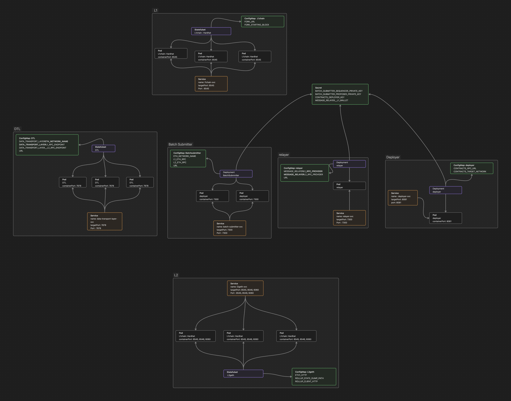

# tokamak-titan-simple-cluster

## Tokamak Titan k8s Resource Diagram

## Prerequisite

- [kubectl](https://kubernetes.io/docs/tasks/tools/#kubectl)
- [minikube](https://minikube.sigs.k8s.io/docs/start/)

If you own an AWS account and want to use EC2, go to [here](./terraform/README.md)

## Let's start Titan network

### 1. Titan Network Node

**Start Node**

### 2. Titan Apps