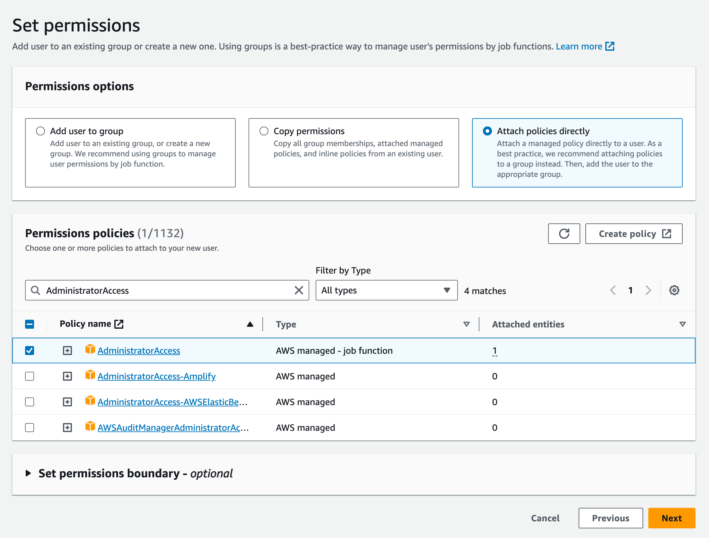
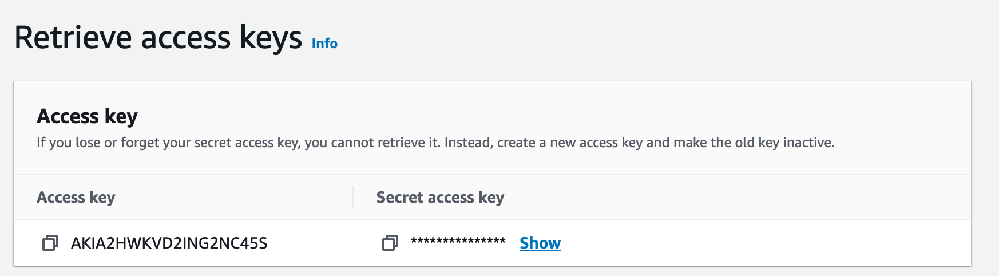

# Terraform for aws-ec2

A terraform for auto provisioning ec2 minikube

## Prerequisite

- [AWS CLI](https://docs.aws.amazon.com/ko_kr/cli/latest/userguide/getting-started-install.html)
- [Terraform](https://developer.hashicorp.com/terraform/downloads)

### Install AWS CLI

**MacOS**

1. In your browser, download the macOS pkg file
   - https://awscli.amazonaws.com/AWSCLIV2.pkg
2. Run your downloaded file and follow the on-screen instructions.
3. To verify that the shell can find and run the aws command in your $PATH, use the following commands.

```bash
which aws
/usr/local/bin/aws

aws --version
aws-cli/2.10.0 Python/3.11.2 Darwin/18.7.0 botocore/2.4.5
```

**Linux**

```bash
# Linux x86 (64-bit)
curl "https://awscli.amazonaws.com/awscli-exe-linux-x86_64.zip" -o "awscliv2.zip"
unzip awscliv2.zip
sudo ./aws/install

# Linux ARM
curl "https://awscli.amazonaws.com/awscli-exe-linux-aarch64.zip" -o "awscliv2.zip"
unzip awscliv2.zip
sudo ./aws/install

```

**Windows**

1. Download and run the AWS CLI MSI installer for Windows
   - https://awscli.amazonaws.com/AWSCLIV2.msi
2. By default, the AWS CLI is installed in C:\Program Files\Amazon\AWSCLIV2.
3. To confirm the installation, check version

```cmd
C:\> aws --version
aws-cli/2.10.0 Python/3.11.2 Windows/10 exe/AMD64 prompt/off
```

### Install Terraform

**Install a specific version by URL**

- latest version terraform: https://www.terraform.io/downloads.html
- previous version terraform: https://releases.hashicorp.com/terraform/
- Move the binary file you installed to /usr/local/bin and you'll be able to use the terraform command.

```bash
curl -sO https://releases.hashicorp.com/terraform/1.6.1/terraform_1.6.1_darwin_amd64.zip
unzip terraform_1.6.1_darwin_amd64.zip
mv terraform /usr/local/bin
terraform --version
Terraform v1.6.1
```

**Use Homebrew**

```bash
brew install terraform
terraform --version
Terraform v1.6.1
```

## Provisioning EC2

### Setting AWS Configure

**Create IAM User**

1. Search IAM Service
2. Click `Users` -> `Create User`
3. Enter a User name and go next
4. Select `Attach policies directly` in Permissions options and check `AdministratorAccess`
   

   and go next

5. Create User
6. Click the created user name
7. Click `Create access key`
8. Check `Command Line Interface (CLI)`
9. Create Access Key
   
10. Keep your secret access key secure.

**Set AWS Configure**

Set up an AWS account with the following command

```bash
aws configure
AWS Access Key ID [None]: <Access Key ID>
AWS Secret Access Key [None]: <Secret Access Key>
Default region name [ap-northeast-2]: ap-northeast-2
Default output format [json]:
```

Finished set up, make sure it's set to the Default using cat ~/.aws/credentials.

```bash
cat ~/.aws/credentials
[default]
aws_access_key_id = ABCDEFXXXXXXX
aws_secret_access_key = KSdifi...
```

To find out who the currently set user is, you can use the command below.

```bash
aws sts get-caller-identity
{
  "UserId": "XXXXX",
  "Account": "1234567891011",
  "Arn": "arn:aws:iam::123456781011:user/test-user"
}
```

### Configure variables

Before provisioning EC2, you need to set up the instance name, type, os etc.

1. change file name `terraform.tfvars.exmaple` to `terraform.tfvars`

```bash
mv terraform.tfvars.exmaple terraform.tfvars
```

2. Fill in `service_name`, `base_ami`, `instance_type`, `key_name`, `minikube_cpus`, `minikube_memory` values
   - For instance types, see the following: [Instance types](https://ap-northeast-2.console.aws.amazon.com/ec2/home?region=ap-northeast-2#InstanceTypes:)
   - For ami, see the following: [Amazon Machine Images](https://ap-northeast-2.console.aws.amazon.com/ec2/home?region=ap-northeast-2#Images:visibility=public-images)

### Run ec2 with terraform

1. Enter the `terraform init` command
   ```bash
   terraform init
   ```
2. Enter the `terraform plan` command
   ```bash
   terraform plan
   ```
3. Enter the `terraform apply` command

   ```bash
   terraform apply
   ```

   if `terraform apply` command is successful, you should see Outputs like this:

   ```bash
   Apply complete! Resources: 1 imported, 5 added, 0 changed, 0 destroyed.

   Outputs:

   connect_instance = "ssh -i simple_cluster.pem ubuntu@3.38.98.152"
   instance_id = "i-0e6be5aa0e9fbbe68"
   instance_public_ip = "3.38.98.152"
   ```

   then, copy connect_instance commands and connect your ec2 instance

   ```bash
   ssh -i simple_cluster.pem ubuntu@3.38.98.152
   ```

### Delete ec2

We recommend deleting instance after testing as you may be charged.

1. Enter the `terraform destroy` command
   ```bash
   terraform destroy
   ```
